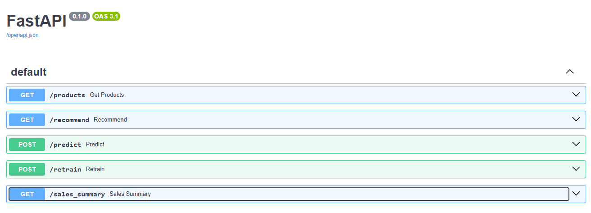
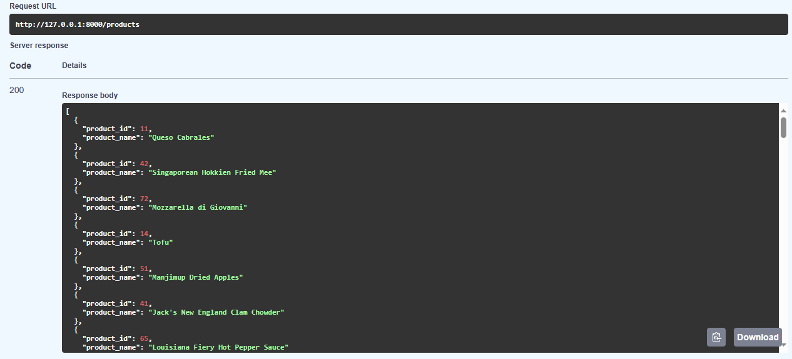
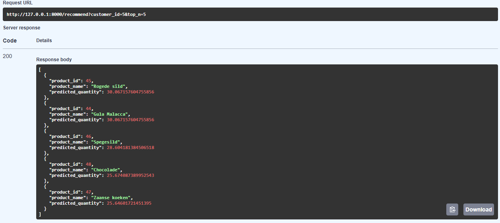
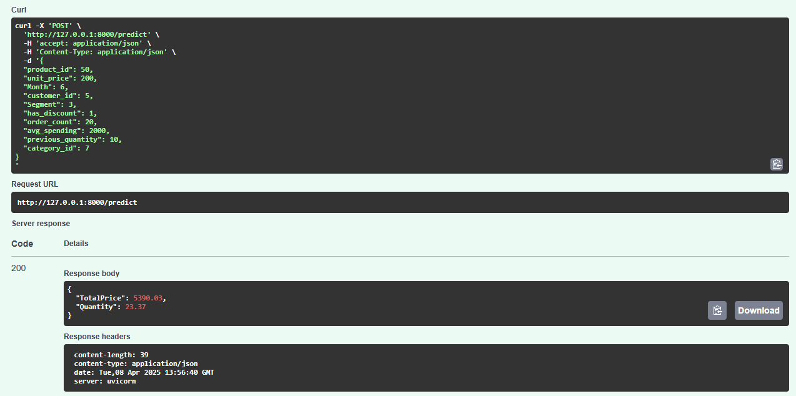
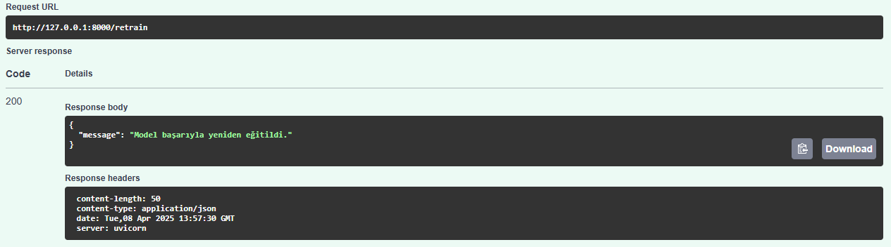
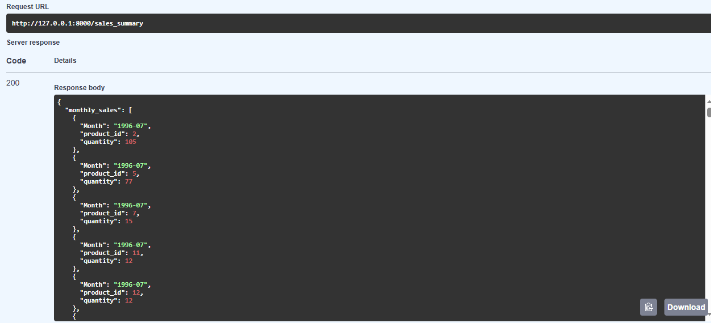

# 🛍️ Satış Tahmini API Projesi

Bu proje, Northwind veritabanı kullanılarak geliştirilmiş bir **Makine Öğrenmesi tabanlı satış tahmin sistemidir**. Model, geçmiş sipariş verilerine dayanarak gelecekteki **ürün satış miktarlarını ve toplam satış değerini** tahmin eder. Ayrıca müşteri bazlı **ürün öneri sistemi** sunar.

## 📦 Proje Bileşenleri

- **Veritabanı:** PostgreSQL (Northwind)
- **Modelleme:** Scikit-learn, RandomForestRegressor
- **API Geliştirme:** FastAPI
- **Veri Erişimi:** SQLAlchemy
- **Model Kaydı:** joblib
- **Swagger / OpenAPI:** Otomatik olarak oluşturulmuştur

---

## 🚀 API Uç Noktaları

